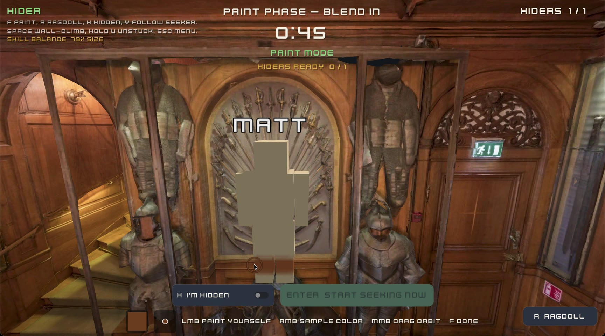
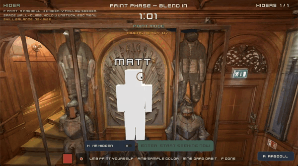
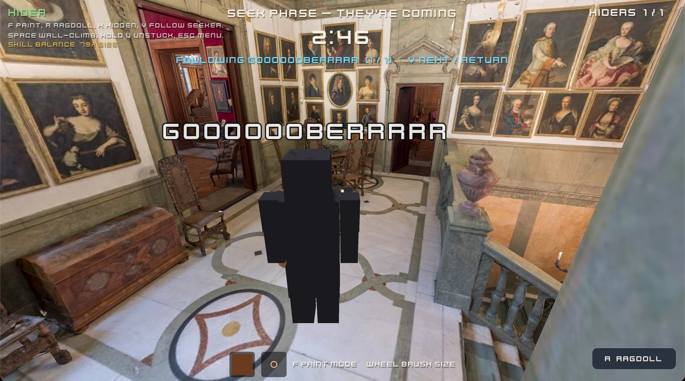
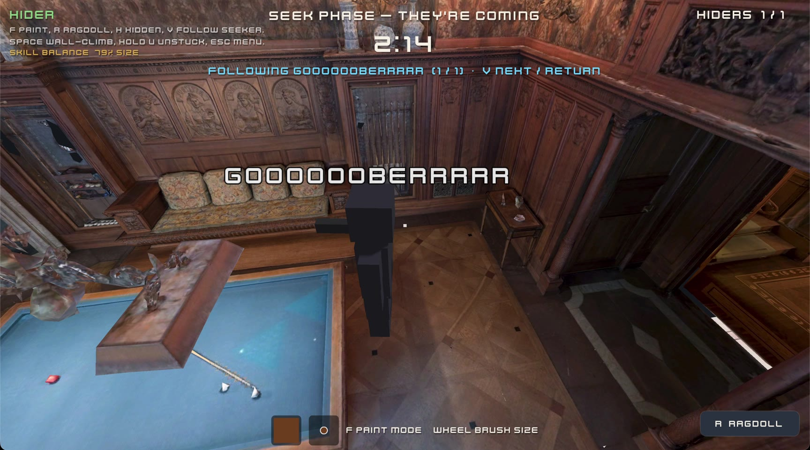

# Paint-n-Seek

Multiplayer hide-and-seek where you hide by painting yourself to match whatever
you're standing in front of. It's basically a clone of MECCHA CHAMELEON, with
one difference: most of its art is deliberately simple and blocky. This branch
uses Godot 4.7's Forward+ renderer so it can also preview Gaussian-splat maps;
those maps require a desktop GPU with compute-shader support.



There's a player in that screenshot. He survived the round.

## How a round works

Everyone joins a lobby and picks a body: human, cat, or dog. The host picks a
map and starts the round. Hiders spawn in pure white. Seekers wait blindfolded
in a pen.

You get 90 seconds to fix the white problem. Hold right-click to sample a color
from anything you can see, then left-click to paint it onto yourself, one brush
stroke at a time. Scroll to change brush size. Find a spot, match it, and press
R to ragdoll into a natural lying pose if standing up straight would give you
away.



Then the seekers are released. They have shotguns, limited ammo, and a timer.
Get shot and you're out. If you're still alive when the timer runs out, the
hiders win. While you're hiding you can press V to spectate the seekers and
watch them walk right past you, which never stops being funny.


The scoring is what makes it interesting: you earn 1 point per second for
staying alive, plus a **3-point-per-second bonus while a seeker can see you**.
Cowering
inside a cupboard is safe and poor. Standing in the open, painted like the
wallpaper, while a seeker stares straight through you, is where the points are.

When the round ends, surviving hiders get marked so everyone can walk over and
see exactly where they were the whole time.


|  |  |
| --- | --- |

The museum map is a real photogrammetry scan of the
[Hallwyl Museum](https://sketchfab.com/3d-models/the-hallwyl-museum-1st-floor-combined-f74eefe9f1cd4a2795a689451e723ee9)
in Stockholm, which turns out to be full of wood paneling, tapestries, and
suits of armor that are extremely good to hide against.

The experimental **Luma Living Room (Gaussian Splat)** map renders the supplied
1.2-million-point Luma AI capture through the bundled GDGS 3.1.0 add-on. It has
only a flat walkable collider under the scanned floor for now: the captured
walls and furniture are visual, not physical. The capture is enlarged 4× for a
dollhouse-scale player-to-room proportion.

The first editor open imports the 67 MB compressed source PLY and can take about a minute;
the generated cache under `.godot/imported` is roughly 535 MB. The source PLY is
tracked with Git LFS.

Between rounds the game quietly balances things. Each player has separate
hiding and seeking ratings for the session, and on replay the struggling
hiders get physically smaller bodies while the dominant ones get bigger. Roles
also rotate fairly, so nobody is stuck seeking all night.

## Getting the game

Download the launcher for your platform from the
[latest release](https://github.com/maccam912/mega-chamomile/releases/latest).
You only do this once.

- **Windows:** grab `paint-n-seek-launcher-windows-x86_64.exe` and double-click
  it. It's unsigned, so SmartScreen will complain the first time. Click "More
  info" then "Run anyway".
- **macOS:** grab `paint-n-seek-launcher-macos-universal.zip`, extract it, and
  Control-click `Paint-n-Seek Launcher.app` and choose Open the first time (it's
  signed but not notarized, since that requires a paid Apple developer
  account). If Open isn't offered, go to System Settings > Privacy & Security >
  Open Anyway.
- **Linux:** grab `paint-n-seek-launcher-linux-x86_64.tar.gz`, extract it, and
  run `paint-n-seek-launcher`.

Every time you start the launcher it checks this repo for the newest release,
downloads and SHA-256-verifies the game package only if there's a new one, and
starts the game. If you're offline or an update fails, it starts the last
version that worked. So the routine for everyone in the house is just:
double-click the launcher, wait a moment, play.

Installed versions and logs live in `%AppData%\PaintNSeek` on Windows,
`~/Library/Application Support/PaintNSeek` on macOS, and `~/.config/PaintNSeek`
on Linux. Deleting that folder fully uninstalls the game (plus the launcher
file itself, wherever you put it).

## Playing together

Two ways to connect:

- **Same network:** one person clicks Host on LAN. The game shows up
  automatically on everyone else's main menu. Joining by IP also works.
- **Over the internet:** the host clicks Host by Code and sends the short code
  to the others. This uses an encrypted [iroh](https://iroh.computer) tunnel,
  so there's no port forwarding or IP-address-reading-over-the-phone involved.

The host can tweak phase timers, seeker count, ammo (fixed or per-hider),
scoring values, and the map. Guests see the full settings before the match
starts. Late joiners wait in the lobby and drop in at the next round, and
someone quitting mid-round never stalls the game for everyone else.

## Controls

| Input | Action |
| --- | --- |
| WASD / mouse | Move / camera |
| Space | Jump, or climb while touching a wall |
| Left click | Paint yourself |
| Right click (hold) | Eyedrop the color under the crosshair |
| Scroll | Brush size |
| F | Enter/leave paint mode |
| R | Ragdoll (lie down) / stand back up |
| H | Confirm you're hidden (undo with H again) |
| V | Spectate/cycle seekers while hiding (SEEK phase) |
| Hold U | Teleport back to spawn if you get stuck |
| Esc | Menu / release mouse |

## Running from source

Open the project in Godot 4.7 and press F5. For a quick local 2-player test,
run two instances: one hosts on LAN, the other joins `127.0.0.1`.

CLI helpers (after `--`): `--name X`, `--host`, `--join <ip>`, `--host-code`,
`--join-code <code>`, `--autostart <n>` (host starts when n players present),
`--fast-phases`, `--quit-after <s>`.

Headless E2E smoke:

```sh
godot --headless -- --host --name Host --autostart 2 --fast-phases --quit-after 30 &
godot --headless -- --join 127.0.0.1 --name Guest --quit-after 30
```

Tests:

```sh
godot --headless -s tests/run_tests.gd
godot --headless tests/lan_discovery_smoke.tscn
```

More reading:

- `docs/DESIGN.md` — mechanics, scoring, architecture decisions
- `docs/PROGRESS.md` — current build state, pick-up-here notes
- `docs/IROH_FEASIBILITY.md` — iroh integration status and remaining hardening
- `launcher/README.md` — how the auto-updating launcher works

## Credits

Art & audio from [Kenney](https://kenney.nl) (CC0). Thanks Kenney!

"[The Hallwyl Museum 1st Floor Combined](https://sketchfab.com/3d-models/the-hallwyl-museum-1st-floor-combined-f74eefe9f1cd4a2795a689451e723ee9)"
by [Thomas Flynn](https://sketchfab.com/nebulousflynn), based on original museum
models by [Erik Lernestål](https://www.eriklernestal.com/), is used under
[CC BY 4.0](https://creativecommons.org/licenses/by/4.0/). It was converted to
a Godot game map and supplied with generated concave collision meshes.
